# 내일배움캠프 iOS - Animation, Transition 데모

<table>
<tr>
<td>
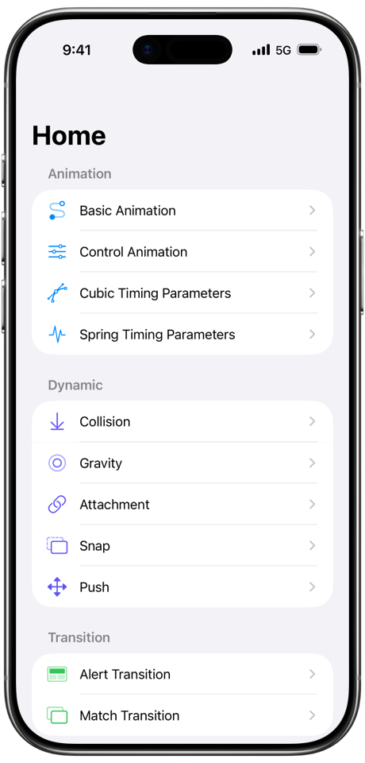
</td>
<td>

### Home
- Animation, Dynamic, Transition, Lottie 등 주제별 섹션으로 예제를 분류해 구성한 데모입니다.
- `UICollectionViewCompositionalLayout`으로 리스트 형태의 메뉴 구성을 확인할 수 있습니다.
- `UICollectionViewDiffableDataSource`를 활용한 예제를 확인할 수 있습니다.

[Source Code](./Animation/ViewControllers/HomeViewController.swift)

</td>
</tr>

<tr>
<td>

</td>
<td>

### Basic Animation
- 이 예제는 UIKit에서 자주 쓰는 기본 애니메이션 속성(`transform`, `alpha`, `color`, `cornerRadius`, `border` 등)이 어떻게 동작하는지 한 화면에서 비교해 보여주는 데모입니다.
- 각 항목은 동일 조건에서 한 가지 속성만 변화시켜, 속성별 애니메이션 특성 차이를 확인할 수 있습니다.
- 반복 재생을 통해 “적용 → 복원” 흐름을 자연스럽게 체감하며, 원래 상태로 되돌리는 패턴을 익히는 데 목적이 있습니다.
- 스크롤 형태로 여러 케이스를 나열해 다양한 기본 애니메이션을 한 번에 탐색하고 비교할 수 있습니다.

[Source Code](./Animation/ViewControllers/Animation/BasicAnimationViewController.swift)

</td>
</tr>

<tr>
<td>
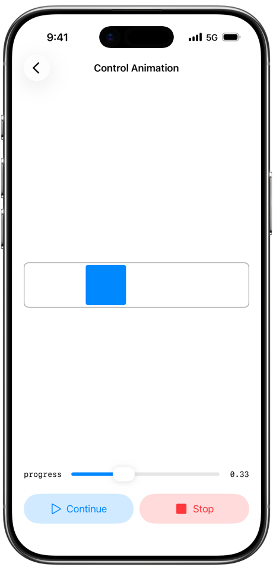
</td>
<td>

### Control Animation
- 이 예제는 `UIViewPropertyAnimator`를 사용해 애니메이션 실행 상태를 직접 제어하는 방법을 보여주는 데모입니다.
- Start / Pause / Continue / Stop 버튼으로 애니메이션의 시작, 일시정지, 재개, 종료를 명확히 비교할 수 있습니다.
- 슬라이더를 이용해 `fractionComplete`를 조작하며 애니메이션 진행률을 임의로 이동시키는 인터랙션을 확인할 수 있습니다.
- `Auto Layout` 제약을 애니메이션 대상으로 사용해 레이아웃 변화도 제어 가능한 애니메이션임을 시각적으로 표현합니다.
- 상태 기반 애니메이션 제어 패턴을 이해하는 데 목적이 있습니다.

[Source Code](./Animation/ViewControllers/Animation/AnimationControlViewController.swift)

</td>
</tr>

<tr>
<td>
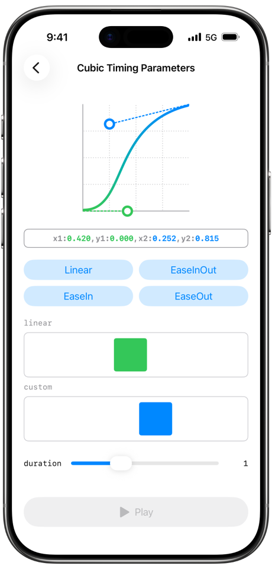
</td>
<td>

### Cubic Timing Parameters
- 이 예제는 `UICubicTimingParameters`를 사용해 애니메이션 속도 곡선(`easing curve`)이 어떻게 달라지는지 시각적으로 비교하는 데모입니다.
- linear / easeIn / easeOut / easeInOut 같은 `built-in curve`를 즉시 적용해보고, `control point`를 조절해 커스텀 Bezier curve를 직접 만들 수 있습니다.
- 동일한 이동 애니메이션을 Linear와 Custom으로 나란히 재생해 curve 차이가 체감에 미치는 영향을 확인합니다.
- Duration 슬라이더로 재생 시간을 조절해 곡선과 시간 조합에 따른 느낌 차이도 실험할 수 있습니다.

[Source Code](./Animation/ViewControllers/Animation/CubicTimingParametersViewController.swift)

</td>
</tr>

<tr>
<td>
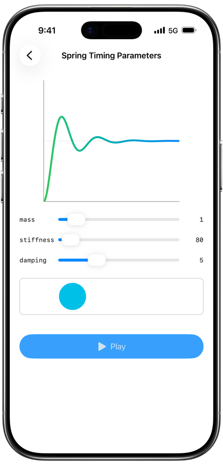
</td>
<td>

### Spring Timing Parameters
- 이 예제는 `UISpringTimingParameters`의 `mass`, `stiffness`, `damping` 값을 조절하며 스프링 애니메이션 변화를 확인하는 데모입니다.
- 슬라이더로 파라미터를 변경하면 뷰에 반영되어 현재 설정이 만드는 스프링 특성을 시각적으로 확인할 수 있습니다.
- Play 버튼을 누르면 동일한 이동 애니메이션을 스프링 타이밍으로 재생해 파라미터 변화가 실제 모션에 미치는 영향을 비교할 수 있습니다.
- duration 감각이 아닌 물리 파라미터 기반으로 스프링 애니메이션을 설계하는 방법을 익히는 데 목적이 있습니다.

[Source Code](./Animation/ViewControllers/Animation/SpringTimingParametersViewController.swift)

</td>
</tr>

<tr>
<td>

</td>
<td>

### Collision
- 이 예제는 UIKit Dynamics의 `UICollisionBehavior`를 이용해 중력으로 떨어지는 물체가 화면 경계와 장애물에 충돌하는 동작을 보여주는 데모입니다.
- 화면을 탭하면 새로운 아이템이 생성되어 중력(`UIGravityBehavior`)의 영향을 받아 아래로 떨어집니다.
- 아이템은 화면 테두리와 하단 바(barrier) 경계에 충돌하며, `UIDynamicItemBehavior`의 탄성(elasticity) 값으로 튕기는 느낌을 확인할 수 있습니다.
- UIKit Dynamics의 충돌과 반발을 체험하는 데모입니다.

[Source Code](./Animation/ViewControllers/Dynamic/CollisionViewController.swift)

</td>
</tr>

<tr>
<td>
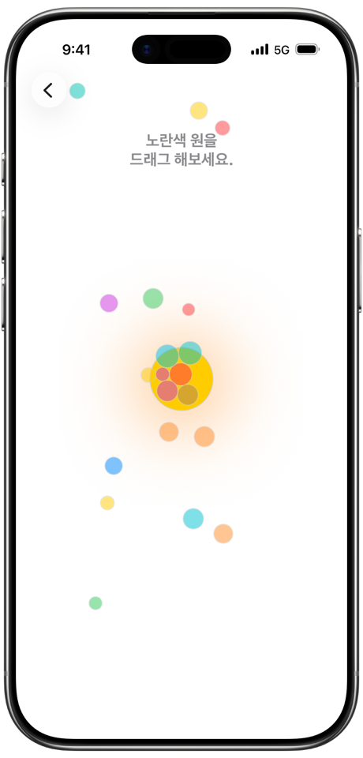
</td>
<td>

### Gravity
- 이 예제는 `UIFieldBehavior.radialGravityField`를 사용해 중력장이 주변 객체에 미치는 영향을 시각적으로 표현하는 데모입니다.
- 중앙 원을 기준으로 여러 객체가 중력 필드에 끌려 움직이며 궤도를 형성하는 모습을 확인할 수 있습니다.
- 원을 드래그하면 중력장 위치가 함께 이동해 실시간으로 중력 중심이 바뀌는 효과를 관찰할 수 있습니다.
- UIKit Dynamics를 활용해 자연스러운 힘 기반 움직임과 상호작용을 구현하는 데모입니다.

[Source Code](./Animation/ViewControllers/Dynamic/GravityViewController.swift)

</td>
</tr>

<tr>
<td>
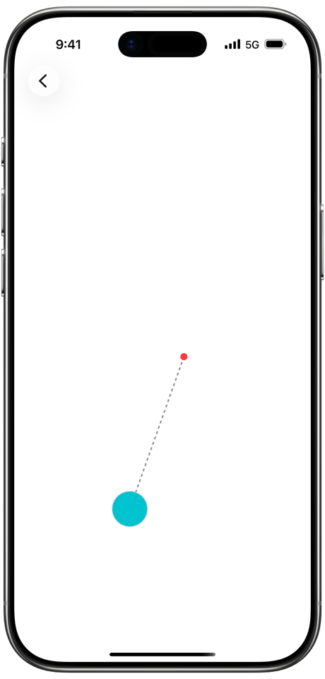
</td>
<td>

### Attachment
- 이 예제는 `UIAttachmentBehavior`를 이용해 객체를 손가락 위치(앵커)에 스프링처럼 연결했을 때 물리 동작을 보여주는 데모입니다.
- 화면을 드래그하면 앵커가 생성되고, 아이템이 줄에 매달린 것처럼 끌려가며 흔들리는 움직임을 확인할 수 있습니다.
- UIKit Dynamics로 탄성, 감쇠, 진동수 기반 스프링 인터랙션을 구현하는 방법을 확인하는 데모입니다.

[Source Code](./Animation/ViewControllers/Dynamic/AttachmentViewController.swift)

</td>
</tr>

<tr>
<td>
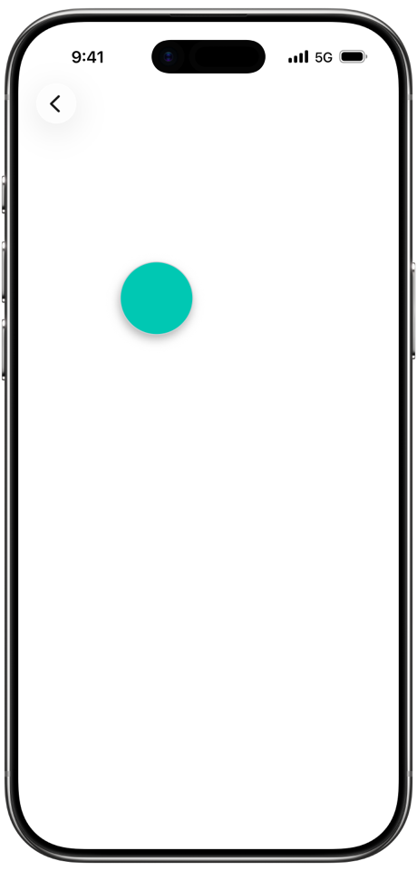
</td>
<td>

### Snap
- 이 예제는 `UISnapBehavior`를 사용해 객체가 특정 지점으로 즉시 끌려가며 정지하는 스냅 동작을 보여주는 데모입니다.
- 화면을 탭하면 아이템이 해당 위치로 고무줄처럼 빠르게 이동하며 스냅됩니다.
- `damping` 값을 통해 스냅 동작의 부드러움과 감쇠 정도를 확인할 수 있습니다.

[Source Code](./Animation/ViewControllers/Dynamic/SnapViewController.swift)

</td>
</tr>

<tr>
<td>
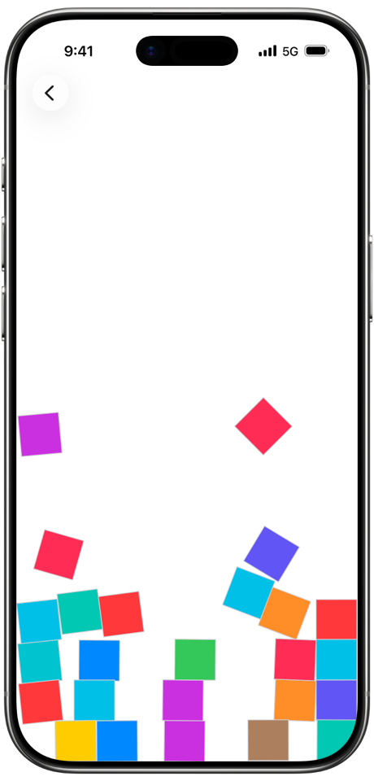
</td>
<td>

### Push
- 이 예제는 `UIPushBehavior`를 사용해 외부 힘이 순간적으로 가해졌을 때 객체들이 튕겨 나가는 효과를 보여주는 데모입니다.
- 화면을 탭하면 해당 지점을 기준으로 주변 블록들이 거리와 방향에 따라 밀려나는 동작을 합니다.
- 중력과 충돌이 함께 적용되어 밀려난 블록들이 자연스럽게 떨어지고 서로 부딪히는 움직임을 확인할 수 있습니다.
- 충격 기반 인터랙션을 구현하는 방법을 확인하는 데모입니다.

[Source Code](./Animation/ViewControllers/Dynamic/PushViewController.swift)

</td>
</tr>

<tr>
<td>
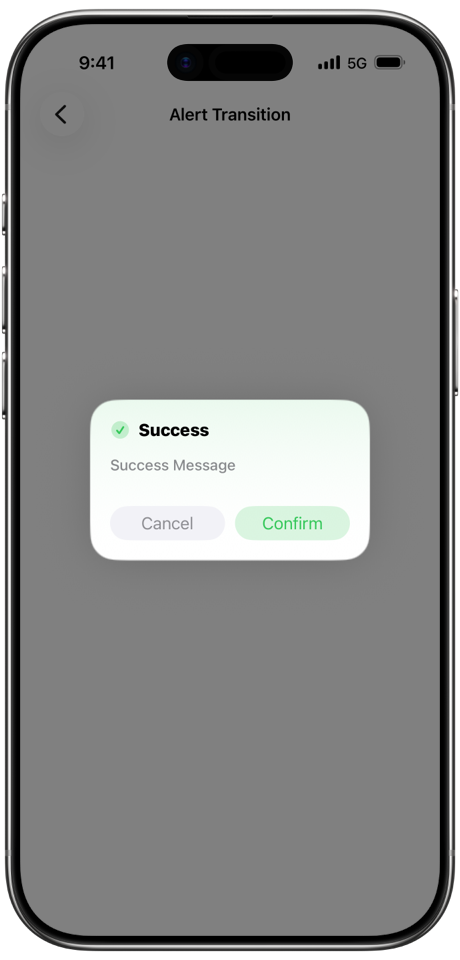
</td>
<td>

### Alert Transition
- 이 예제는 기본 `UIAlertController`가 아닌 커스텀 전환 애니메이션을 적용한 Alert 화면을 보여주는 데모입니다.
- Success / Error 버튼으로 서로 다른 스타일의 Alert를 표시하며, 전환 애니메이션의 공통 구조를 재사용하는 방식을 확인할 수 있습니다.
- Alert는 모달로 표시되며, `presentation`과 `dismissal` 과정에서의 커스텀 전환에 초점을 둔 데모입니다.

[Source Code](./Animation/ViewControllers/Transition/Alert/AlertTransitionViewController.swift)

</td>
</tr>

<tr>
<td>
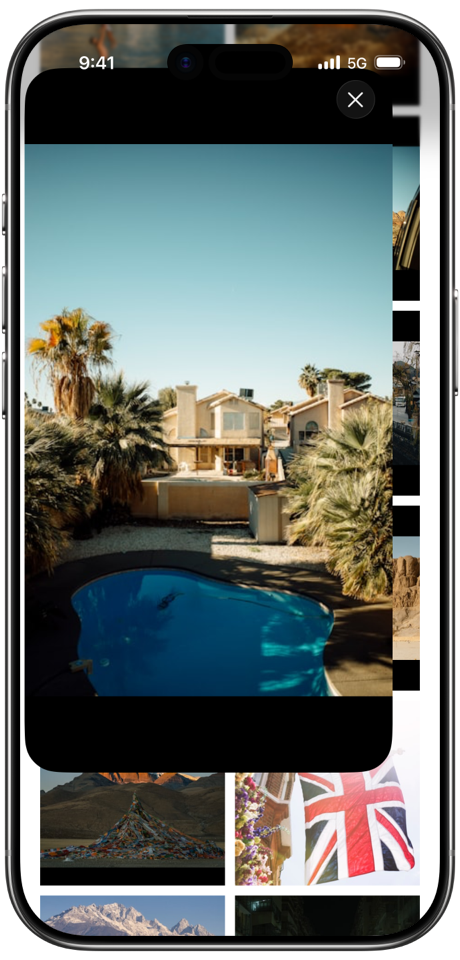
</td>
<td>

### Match Transition
- 이 예제는 이미지 그리드에서 특정 이미지를 선택했을 때 상세 화면으로 자연스럽게 이어지는 매칭 전환 애니메이션을 보여주는 데모입니다.
- 스크롤 하단에 도달하면 다음 페이지를 로드하는 방식으로, 실제 앱에서 흔한 “피드 + 상세 + 페이지네이션” 시나리오를 함께 다룹니다.

[Source Code](./Animation/ViewControllers/Transition/Match/MatchTransitionViewController.swift)

</td>
</tr>

<tr>
<td>
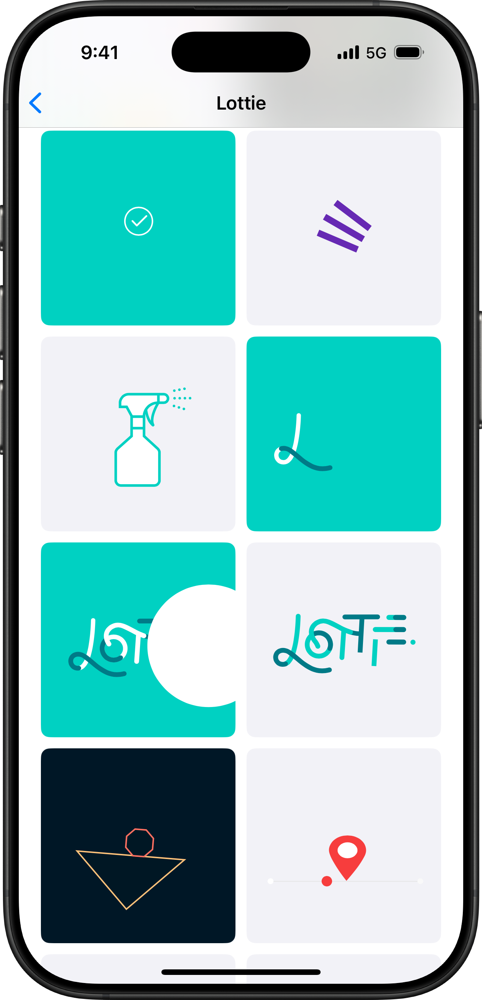
</td>
<td>

### Lottie
- 이 예제는 `Lottie JSON` 파일 목록을 보여주고 각 애니메이션을 즉시 미리보기, 탐색할 수 있는 데모입니다.
- 그리드 형태로 여러 `Lottie 애니메이션`을 동시에 재생해 파일별 모션과 분위기를 비교할 수 있습니다.
- 셀을 선택하면 해당 JSON을 로드해 상세 프리뷰 화면으로 이동해 개별 애니메이션을 집중해서 확인할 수 있습니다.

[Source Code](./Animation/ViewControllers/Lottie/LottieListViewController.swift)

</td>
</tr>

</table>
