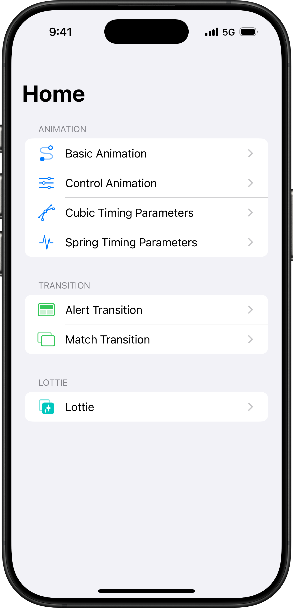

# 내일배움캠프 iOS 마스터 트랙 7기 - Animation, Transition 데모

## Menu


## Basic Animation
```
기본적인 애니메이션 동작 예제
```


## Control Animation
```
UIViewPropertyAnimator의 각 상태별 동작 예제
```


## Cubic Timing Parameters
```
UICubicTimingParameter를 만들고 시뮬레이션 할 수 있는 예제
```


## Spring Timing Parameters
```
UISpringTimingParameter를 만들고 시뮬레이션 할 수 있는 예제
```


## Alert Transition
```
UIViewControllerTransitioningDelegate를 활용한 Alert Transition 예제
```


## Match Transition
```
UIViewControllerTransitioningDelegate를 활용한 Match Transition 예제
```


## Lottie
```
Lottie 사용 예제
```

